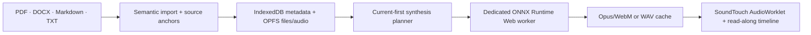

# Voicebook

[](https://github.com/NeoVand/voicebook/actions/workflows/ci.yml)
[](https://github.com/NeoVand/voicebook/actions/workflows/pages.yml)
[](https://github.com/NeoVand/voicebook/actions/workflows/codeql.yml)
[](https://securityscorecards.dev/viewer/?uri=github.com/NeoVand/voicebook)
[](LICENSE)
[](https://github.com/NeoVand/voicebook/releases)
[](https://github.com/NeoVand/voicebook/stargazers)

Voicebook is a private, local-first document reader that turns PDF, DOCX, Markdown, and text files into expressive speech in the browser. There is no account, backend, telemetry, or document upload. Initial model downloads contact Hugging Face; documents, bookmarks, generated audio, and voice choices remain on the device.

> Voicebook is pre-release software. The repository is production-shaped, but the `v1.0.0` release is intentionally held until real-model WebGPU benchmarks and the live Pages recovery matrix pass on the documented reference machine.

## What works

- Semantic import for text PDFs, DOCX, GFM Markdown, TXT, and pasted text.
- A persistent IndexedDB + OPFS library with SHA-256 duplicate detection and storage repair.
- Explicit Supertonic 3 installation with a pinned revision, license disclosure, WebGPU capability checks, and WASM fallback.
- Ten built-in voices and 31 supported languages through the official browser runtime.
- Dedicated-worker synthesis, cancellation, GPU-loss recovery, current-first generation, and a rolling three-segment buffer.
- 0.5–3× pitch-preserving playback, ±10-second seek, semantic bookmarks, resume, keyboard controls, Media Session integration, and sentence/word read-along.
- An app-shell service worker that keeps documents and audio out of Cache Storage while supporting offline reopening.

Scanned PDF OCR, legacy `.doc`, EPUB/HTML, voice cloning, cloud sync, mobile support, and PDF layout reproduction are deliberately outside v1.

## Run locally

Requirements: Node.js 24+, npm, and current desktop Chrome or Edge for the supported WebGPU path.

```bash
npm ci
npm run dev
```

Quality gates:

```bash
npm run quality
npx playwright install chromium
npm run test:e2e
```

To reproduce the GitHub Pages mount locally:

```bash
BASE_PATH=/voicebook npm run build
npm run preview:pages
```

Open `http://127.0.0.1:4173/voicebook/`.

## Architecture



The stable contracts live in `src/lib/domain/types.ts`. The model catalog pins repository commits, so an upstream `main` update cannot silently change Voicebook’s runtime. Read [the architecture notes](docs/architecture.md) and [model decision record](docs/model-decision.md) for the tradeoffs.

## Model policy

| Engine       | Role        | License                             | Languages    | Timing                       |
| ------------ | ----------- | ----------------------------------- | ------------ | ---------------------------- |
| Supertonic 3 | Only engine | OpenRAIL-M; acknowledgment required | 31 languages | Duration-normalized estimate |

Noncommercial models are excluded. Voice cloning is tracked as a later, opt-in local capability using the official Transformers.js Chatterbox architecture after memory and latency benchmarking.

## Privacy and security

- Document contents are never sent to Voicebook or a Voicebook server—there is no server.
- Installing a model downloads pinned files from `huggingface.co` into the browser-managed model cache.
- Imported originals and generated speech use namespaced on-device storage and never enter the service-worker cache.
- No remote fonts, analytics, telemetry, or third-party document processing are used.

Please report vulnerabilities through the process in [SECURITY.md](SECURITY.md), not a public issue.

## Contributing

Useful bug reports, parsing fixtures, accessibility improvements, benchmark results, and model-adapter work are welcome. Start with [CONTRIBUTING.md](CONTRIBUTING.md), follow the [Code of Conduct](CODE_OF_CONDUCT.md), and keep changes covered by tests.

The project is MIT licensed. Mediabunny and SoundTouch remain MPL-2.0; see [THIRD_PARTY_NOTICES.md](THIRD_PARTY_NOTICES.md).
