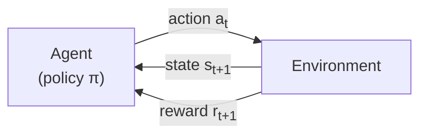
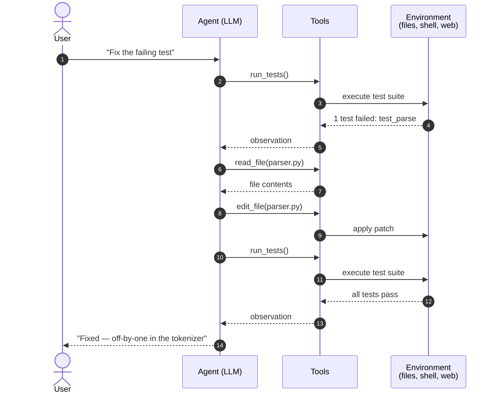

# AI Agents: A Short Overview

An **agent** is a system that perceives its environment, decides on an action, and acts to achieve a goal — then repeats. What separates an agent from a plain model is the loop: instead of producing one answer and stopping, an agent observes the outcome of each action and uses it to choose the next one. This document sketches the core ideas, formalizes the decision loop, and compares the main agent architectures in use today.

## The agent loop

Every agent, from a thermostat to a coding assistant, runs some version of the same cycle:

1. **Observe** the current state of the environment.
2. **Decide** on an action using a policy.
3. **Act**, changing the environment.
4. **Learn** (optionally) from the outcome, then return to step 1.

The environment is rarely fully visible. A software agent sees tool outputs and files, not the whole system; a robot sees sensor readings, not the room itself. Agents therefore maintain an internal _belief state_ — a running estimate of what the world looks like — and update it as new observations arrive.

The classic picture of this cycle — the agent–environment interaction diagram from reinforcement learning — looks like this:

Everything the agent does flows through the single arrow on top; everything it knows flows back through the two arrows below. The formalism in the next section is just this picture written in math.

## Formalizing the loop

The standard formal model is the **Markov Decision Process**. At each step $t$ the agent is in state $s_t$, takes action $a_t$, receives reward $r_t$, and transitions to a new state. The agent's objective is to maximize the expected discounted return:

$$
G_t = \mathbb{E}\left[ \sum_{k=0}^{\infty} \gamma^k \, r_{t+k+1} \right], \qquad 0 \le \gamma < 1
$$

where the discount factor $\gamma$ controls how much the agent values future reward relative to immediate reward. A behavior is captured by a **policy** $\pi(a \mid s)$, the probability of taking action $a$ in state $s$. The quality of acting from a state under a policy is its value function, defined recursively by the **Bellman equation**:

$$
V^{\pi}(s) = \sum_{a} \pi(a \mid s) \sum_{s'} P(s' \mid s, a)\left[ R(s, a, s') + \gamma \, V^{\pi}(s') \right]
$$

Solving for the policy that maximizes this value is the central problem of reinforcement learning. For LLM-based agents the same structure holds informally: the "state" is the conversation and tool context, the "actions" are tool calls and messages, and the "policy" is the model itself, selecting each action by sampling

$$
a_t \sim \pi_\theta(\,\cdot \mid s_t\,)
$$

from a distribution shaped by pretraining, fine-tuning, and the prompt.

## Agent architectures

Different problems call for different amounts of machinery. The main architectures, roughly in order of increasing sophistication:

| Architecture   | Decision basis                    | Memory | Example                         |
| :------------- | :-------------------------------- | :----: | :------------------------------ |
| Simple reflex  | Current percept only              |   No   | Thermostat                      |
| Model-based    | Percept + internal world model    |  Yes   | Robot vacuum mapping a room     |
| Goal-based     | Search/planning toward a goal     |  Yes   | Route planner                   |
| Utility-based  | Expected utility of outcomes      |  Yes   | Trading system                  |
| Learning       | Improves its policy from feedback |  Yes   | Reinforcement-learning game bot |
| LLM tool-using | Language reasoning + tool calls   |  Yes   | Coding assistant                |

Modern LLM agents blend several rows of this table: they carry a goal in the prompt, hold a world model in context, estimate usefulness of next steps implicitly, and increasingly learn from feedback across sessions.

## What makes LLM agents different

Classical agents operate in narrow, well-defined action spaces — a chess program can only move pieces. LLM agents act through **tools**: shell commands, file edits, web requests, API calls. This makes the action space enormous and open-ended, which brings two practical consequences.

First, _planning becomes linguistic_. Instead of searching a game tree, the agent decomposes a task in natural language ("first read the file, then run the tests"), executes a step, and revises the plan based on what it observes. Failures are recoverable because the loop continues: a failed test is just another observation.

A typical run of an LLM coding agent, step by step:

Note that steps 2–13 are the agent loop from the first diagram, unrolled in time: each tool call is an action, each result an observation that shapes the next decision.

Second, _reliability becomes the bottleneck_. A single bad action in a long chain can derail the task, and the probability of a flawless run decays multiplicatively: an agent that executes each step correctly with probability $p$ completes an $n$-step task with probability roughly $p^n$. At $p = 0.98$ and $n = 50$, that is only about 36%. This is why agent engineering focuses on verification, checkpointing, and designing tasks so errors are detected and corrected early rather than compounding silently.

## Where this is heading

The trajectory is toward longer horizons and higher autonomy: agents that manage multi-hour tasks, coordinate with other agents, and verify their own work. The fundamentals stay the same — observe, decide, act, learn — but each generation pushes $p$ closer to 1 and $n$ higher, and the useful task length grows with both.
